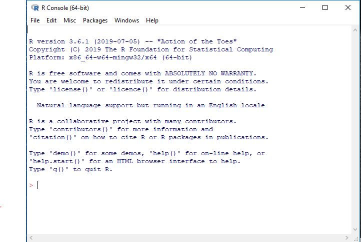
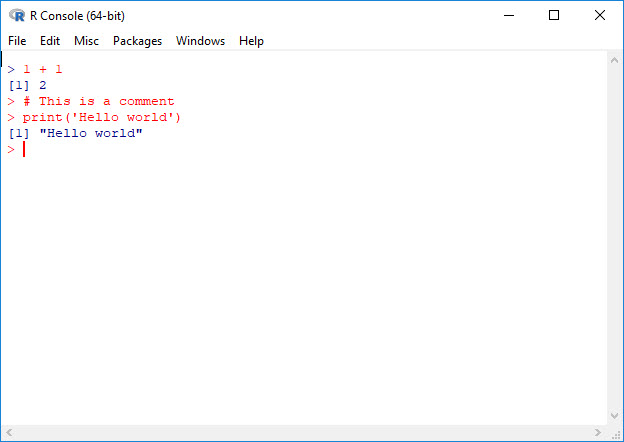

```{r setup, include=FALSE}
knitr::opts_chunk$set(echo = TRUE, comment = NULL)
```


# What is R?

## What is R?

* R is a well developed, simple and effective **programming language**, and

* An integrated **software environment** for: 

    + data manipulation, calculation
    + data handling and storage
    + data analysis
    + publication quality graphics

more info on : [https://cran.r-project.org](https://cran.r-project.org)

## Why Do I use R to Teach?

* R is more **fundamental** 
* R is more **flexible**
* R is **open source** and **accessible**
* R is more **reproducible**

# Setting up your Workflow

## Create Distinct Projects

* Store all relevant files in a designated **project folder**
* Use a consistent **structure** for folder and file
* Use consistent **naming conventions** for folders and files
* Use **relative file paths** 
* **Document, document, document** (use README files and comment your code)

## An Example of a Project Folder

```
data
  csv
    rawdata.csv
  Rdata
    mtcars.Rdata
  spss
    mtcars.sav
figures
  au.png
R
  import_rawdata.R
reports
  Descriptive_mtcars_Report
    Descriptive_mtcars_Report.Rmd
sps
  mtcars_anova.sps


```
## Storing Projects

* Make sure your project is in a safe location
* If you are on a virtual system, make sure your work will not be erased when you log off.
* Store original data in archival format (e.g. csv or tab delimited) and not program specific format (e.g., .sav or .Rdata)
* Consider version control software (e.g., git)

# Introduction to the R console

## R console



## Prompt and Comments



## R as a Calculator

```{r echo=TRUE}
1 + 1  # Addition

2 - 1  # Subtraction

3 * 4   # Multiplication

12/3   # Division

3^2    # Square
```

## R as a Calculator

Some built-in functions:
```{r echo=TRUE}
sqrt(9)
log(2.718282)
exp(1)
```

# Vectors, Objects and Environments

## Vectors and assignment | `c()` and `<-`

* R operates on named data structures. 
* The simplest is the numeric vector, which is a single entity consisting of an ordered collection of numbers
* To set up a vector named x, say, consisting of five numbers, namely 10.4, 5.6, 3.1, 6.4 and 21.7, use the R command:

```{r}
x <- c(10.4, 5.6, 3.1, 6.4, 21.7)
```

## Creating objects with the assignment (`<-`) operator:

```{r}     
c(6.5, 5.4, 5.1, 6.0)
```


```{r}
heights <- c(6.5, 5.9, 5.6, 6.0)
```

```{r}
heights
```

## Objects

* R operates on *objects*. 
* Objects have a *mode* and a *length*.

## Mode | `mode()`

* **Atomic** (fundamental)
    - numeric: (1, 4, .45, 1.75)
    - logical: (TRUE, FALSE)
    - character ("treatment", "control")
* **Recursive** (complex)
    - list (dataframe, lm)
    - function (`mean`, `sqrt`, user defined)
    
## length | `length()`

* All objects have a length

```{r}
x

length(x)
``` 


## Lists

* An ordered collection of objects known as components
* the components can be of different modes and lengths

## Example list

```{r}
Lst <- list(name="Fred", wife="Mary", no.children=3,
              child.ages=c(4,7,9))

Lst
```


## Data frame

* A data frame is a special type of list
    - each column must consist of elements of one mode
    - all columns must have the same length

* Accessing variables within an object
    - df$variable
    - df[ ,'variable']
    - with(df, mpg)]
    
## Functions 

Take the form of:
```{r, eval = FALSE}
name <- function(arg_1, arg_2) expression
```

* name: a name given by the user
* arg_1: first argument to the function. Arguments are inputs
* expression: R code that does something


## Character vector
```{r}
condition <- c("treatment", "control", "control", "treatment")

condition
```

## Factors

```{r}
A <- factor(condition)
A
```

## Getting Help

```{r, eval=FALSE}
help.start()
help(mean)
```

## Listing Objects in the R environment | `ls()`

```{r}
ls()
```

## Packages in R

* All R functions and datasets are stored in packages
* Base R packages are loaded when R starts
* There are nearly 15,000 user created packages on CRAN
* User created packages must be installed once, then loaded each time you start R

# R Commander
